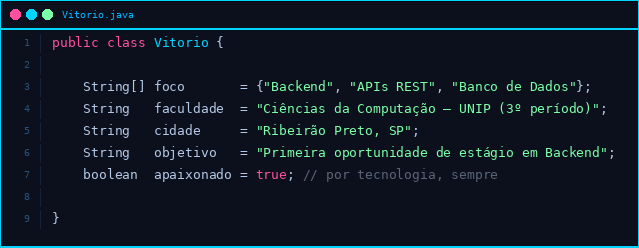

  

  

---

- 🚀 Sou um estudante do curso de Ciências da Computação focado em **desenvolvimento backend**,
   apaixonado por tecnologia, dados e codar!
  

- ⚡️ Gosto e sou fascinado em criar **aplicações relevantes** e **resolver problemas reais do cotidiano**!

 🧑🏻‍💻 Mais sobre mim

- 🌱 Tenho 19 anos e sou natural de Ribeirão Preto, SP. Estou no 3º período de Ciências da Computação na UNIP e, paralelamente, curso Técnico em Assistente de Vendas, o que me dá uma visão tanto técnica quanto comercial do mundo tech.

- 🏃🏻‍♂️ Minha jornada na programação começou há 1 ano e 6 meses e desde então não parei mais. Já desenvolvi projetos que vão desde sites turísticos até sistemas de análise de dados ambientais, sempre buscando aplicar o que aprendo na prática.

- 🧠 Meu foco atual é o desenvolvimento backend, onde trabalho com Java, Spring Boot e PostgreSQL, construindo APIs REST sólidas e bem estruturadas. Mas também transito pelo frontend com HTML, CSS e JavaScript, e uso Python para automação e análise de dados.

- 💡 Acredito que um bom desenvolvedor não é só aquele que escreve código limpo, mas aquele que entende o problema antes de começar a resolver. Por isso me interesso tanto por arquitetura de software quanto por soluções que realmente façam diferença no dia a dia das pessoas.

 

---

|  |  |  |
|:-:|:-:|:-:|

|  |  |
|:-:|:-:|

